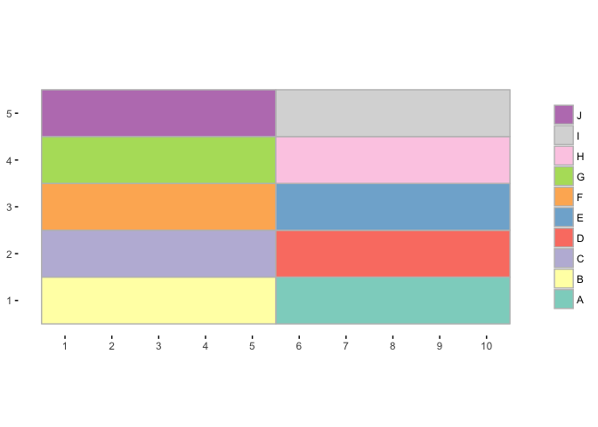
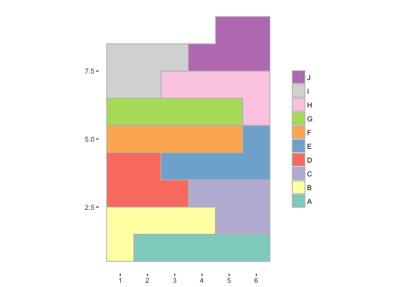
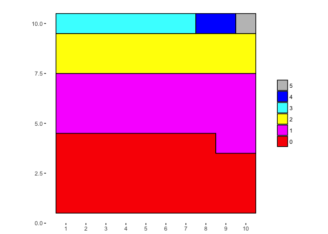
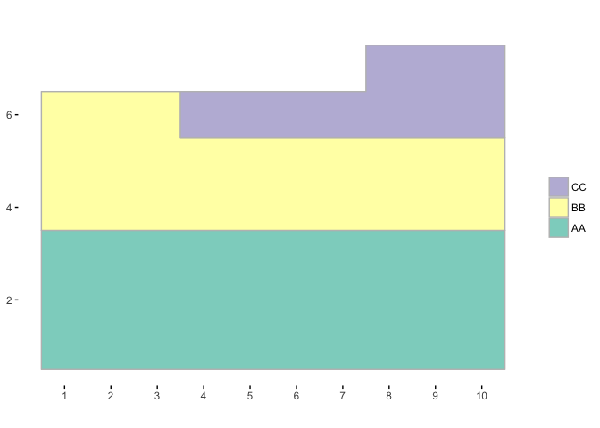
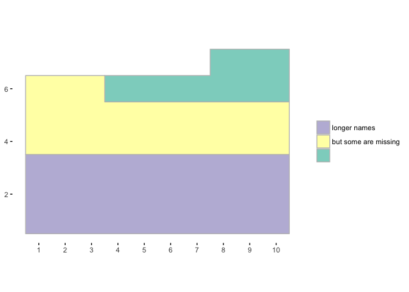
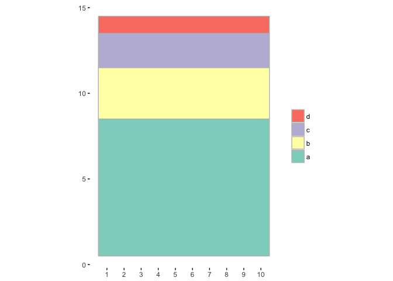
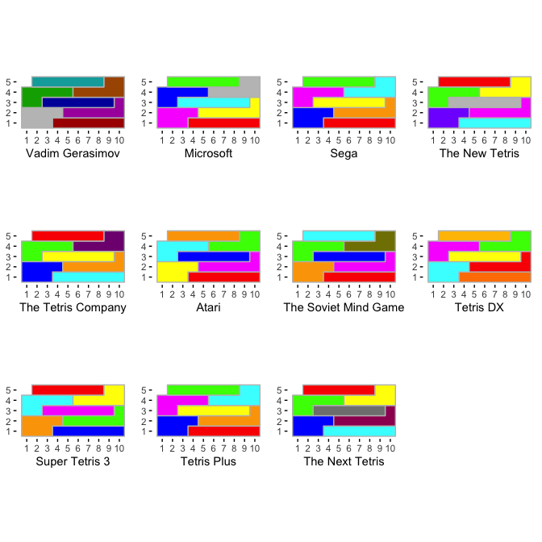
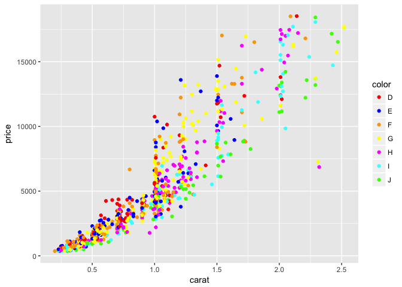

<!-- README.md is generated from README.Rmd. Please edit that file -->

# ggtetris

[](https://travis-ci.org/EmilHvitfeldt/ggtetris)

The goal of **ggtetris** is to add a fun alternative to `geom_bar` that
stack squared together to represent groups. This happens to have a
resemblance to a tetris board hence name.

It used ggplot2 and returns a ggplot2 object.

The main star of the package is `ggtetris()` that produces a finished
chart from a variety of inputs. In addition the package also provides
the `ggtetris_tidy()` function that transform the inputs of `ggtetris()`
into a tidy format. `tetris_color()` provides a range of color schemes
and the `scale_*_tetris()` family will allow you to use those color
palettes directly to ggplot2.

## Installation

You can install **ggtetris** from github with:

``` r
# install.packages("devtools")
devtools::install_github("EmilHvitfeldt/ggtetris")
```

## Examples

``` r
library(ggtetris)
#> Loading required package: ggplot2
```

### Unnamed vectors

``` r
counts <- rep(5, 10)
ggtetris(counts)
```

<!-- -->

``` r
ggtetris(counts, colunms = 6)
```

<!-- -->

``` r
raw_data <- rpois(100, lambda = 1)
counts <- table(raw_data)
ggtetris(counts, colors = tetris_color(palette = "Microsoft"), line_color = "black")
```

<!-- -->

### Named vectors

``` r
ggtetris(c('AA' = 30, 'BB' = 23, 'CC' = 10))
```

<!-- -->

``` r
ggtetris(c('longer names' = 30, 'but some are missing' = 23, 10))
```

<!-- -->

### Dataframes

``` r
counts <- data.frame(names = letters[1:4],
                     vals = c(80, 30, 20, 10))

ggtetris(counts)
```

<!-- -->

### Colors

<!-- -->

## miscellaneous

``` r
vec_named <- c('AA' = 3, 'BB' = 2, 'CC' = 1)
ggtetris_tidy(vec_named)
#> # A tibble: 6 x 1
#>   group
#>   <chr>
#> 1 AA   
#> 2 AA   
#> 3 AA   
#> 4 BB   
#> 5 BB   
#> 6 CC
```

``` r
dsamp <- diamonds[sample(nrow(diamonds), 1000), ]
ggplot(dsamp, aes(carat, price)) +
  geom_point(aes(colour = color)) + 
  scale_colour_tetris(palette = "Sega")
```

<!-- -->
